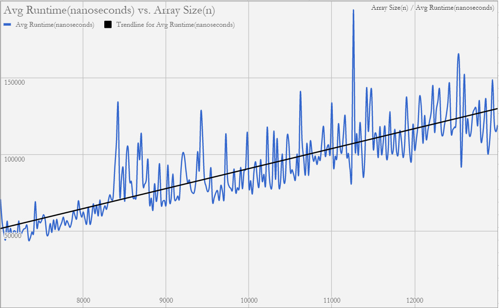

# Loc-n-Load -- MatrixFinder
Xiaojie(Aaron) Li
 
Jackie Li
 
George Liang
### Hypothesis
Our code operates through the list once, starting at the top right corner. As long as the index has not been discovered, 
and the value we are searching for is valid, we continue to search for the target, by using the rules established by our algorithm. We hypothesize that our search algorithm runs in linear time because even for the worst-case scenario, the number of elements iterated never meets or exceeds O(n^2).

### Background
Our inspiration for this algorithm came from the telescope problem from the final. In the problem, we were asked to be iterate
through a matrix in a ladder-like formation. We are incorporating a similar algorithm, where we serpentine through the matrix, 
searching for our desired value, except the indices move according to value comparisons instead of always in a zig-zag fashion. 

### Experiment Methodology
First, check if the desired value is even possibly within the array. This is
done by checking if the desired value is larger than the smallest value of the
array (0, 0), and smaller than the largest value of the array (size - 1, size - 1),
and if it isn't within those parameters, it is not found.

Next, the search begins at the element at the top right, and if that element
is the desired value, its coordinates are returned. Otherwise, the following
decisions take place in the while loop:
* if value at index is smaller than desired value: move down a row
* if value at index is larger than desired value: move left a column

Based on various tests, we know our algorithm works as intended. For our lab, we generated matrices increasing by 20 elements each time 
that had 7000 to 13000 elements. We measured the runtime of searching for the bottom left element of each matrix
1000 times by using a for loop and Java's built in nanoTime. After 1000 calls to our search() method for each array, we divided it by 1000 to find the average time of a search of the bottom left element of one matrix. Then, the size of the array is SOP'ed along with its average runtime, separated by commas, in order to be able to import it into Google Spreadsheets. This was repeated for each matrix.

### Results
# Spreadsheets w/ Graph:
https://goo.gl/fXdtpB

### Conclusions
Although our data often fluctuate, this was expected because hidden background processes slow down Java's runtime. Based on the line of best fit drawn in our Google Spreadsheet (which is based on our csv file), our algorithm follows a linear slope, which provides evidence that our algorithm follows a linear runtime. However, we don't believe this evidence is enough to clearly say that the search algorithm runs in linear time because of the various fluctuations and independent factors at play during the experiment.   
